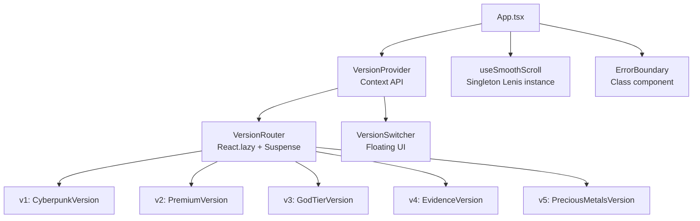

<div align="center">

# HARSH LAB

### AI Systems · Applied Machine Learning · Intelligent Software · Robotics

> *Where AI becomes systems.*

[](https://harsh-lab-one.vercel.app/)
[](https://github.com/HarshkumarG007)
[](https://www.linkedin.com/in/harshkumarg/)

</div>

---

## 🧠 What is HARSH LAB?

HARSH LAB is the personal engineering portfolio and experimental workspace of **Harsh Kumar Gupta** — an AI/ML Engineer, IBM SkillsBuild Faculty, and Security Specialist.

It is not a conventional developer portfolio. It is a living engineering lab that documents how I think about building reliable AI systems, from research to architecture to production.

```text
Problem → Research → Architecture → Implementation → Evaluation → Failure Analysis → Iteration → Shipping
```

**HARSH LAB** brings together work across:

| Domain | Focus |
|---|---|
| 🤖 Artificial Intelligence | LLM systems, agents, RAG pipelines |
| 🧬 Machine Learning | Applied ML, recommendation systems, geospatial ML |
| 🔐 Cybersecurity | AI security, digital forensics, threat intelligence |
| 📚 Knowledge Graphs | Entity resolution, temporal reasoning |
| 🤝 Education | IBM SkillsBuild Faculty, curriculum design |
| 🦾 Robotics & IoT | Embedded systems, autonomous agents |

---

## 🌐 Live Portfolio

**[harsh-lab-one.vercel.app](https://harsh-lab-one.vercel.app/)**

The portfolio features **5 distinct design versions** — switchable at runtime via the floating version switcher (bottom-right corner, or `Ctrl+Shift+V`):

| Version | Theme | Character |
|---|---|---|
| `v1` Matrix | Cyberpunk neon | Dark, urgent, technical |
| `v2` Luxe | Apple × Linear × Stripe | Clean minimalist luxury |
| `v3` God Mode | Physics-based interactions | Buttery spring animations |
| `v4` Evidence | Radical transparency | Commit-verified, data-first |
| `v5` Haute Couture | Gold, Platinum, Gemstone materials | Photorealistic premium |

---

## 🚀 Featured Projects

| Project | Domain | Description |
|---|---|---|
| **LeadGuard** | Geospatial ML | Lead exposure prediction using satellite imagery and ML |
| **PRERNA** | Local-first AI | Offline-capable personal AI assistant for rural India |
| **CogniGuard** | AI Security | LLM security auditing and red-teaming framework |
| **PROMETHEUS** | Personal AI | Autonomous personal AI system with persistent memory |
| **MNEMOSYNE** | Digital Forensics | AI-powered forensic timeline reconstruction |
| **ChronoScope** | Temporal Forensics | Temporal reasoning for digital evidence chains |
| **OMNISCIENT** | Threat Intelligence | Multi-source search and threat correlation engine |
| **netflix_recsys** | Recommendation | Collaborative filtering recommendation system |

---

## 🏗️ Architecture



### Performance Architecture

- **Mouse tracking**: `useMotionValue` from framer-motion — bypasses React's render cycle entirely. Zero re-renders on `mousemove`.
- **Scroll**: Single Lenis instance at App level — prevents competing instances during version transitions.
- **Canvas**: MatrixRain capped at 30fps via timestamp throttle (saves ~35% CPU on 144Hz displays).
- **GPU**: `contain: paint layout` on orb containers isolates expensive `blur()` repaints.
- **Transitions**: No `filter: blur()` on full-screen containers. Simple `opacity + translateY` at 0.35s.

---

## 🛠️ Tech Stack

| Layer | Technology |
|---|---|
| Framework | React 18 + TypeScript |
| Build | Vite 5 |
| Animation | Framer Motion 10 |
| Styling | Tailwind CSS 3 + Custom CSS |
| Smooth Scroll | Lenis (@studio-freight) |
| Icons | Lucide React |
| 3D (planned) | Three.js + React Three Fiber |
| State | React Context API |
| Deployment | Vercel |
| CI/CD | GitHub → Vercel Auto-Deploy |

---

## 📐 Engineering Philosophy

I am interested in the gap between:

> *"AI can do this"* and *"Here is a reliable system that actually does it."*

Most AI demos die in notebooks. My focus is on the engineering surrounding AI models — the retrieval, reasoning, security, interfaces, and evaluation infrastructure that makes them useful.

```text
Models + Data + Retrieval + Reasoning + Tools + Security + Interfaces + Evaluation = Useful AI Systems
```

---

## ⚡ Local Development

```bash
# Clone the repository
git clone https://github.com/HarshkumarG007/HARSH-LAB.git
cd HARSH-LAB

# Install dependencies
npm install

# Start dev server
npm run dev
# → http://localhost:5173

# Type check
npx tsc --noEmit

# Production build
npm run build
```

### Requirements
- Node.js 18+
- npm 9+

---

## 🏷️ Version History

| Tag | Description | Highlight |
|---|---|---|
| `v1.0.0-cyberpunk` | Matrix rain, neon aesthetic | Custom canvas animation |
| `v2.0.0-premium` | Luxe design system | Lenis smooth scroll |
| `v3.0.0-god-tier` | Physics-based interactions | `useSpring` magnetic buttons |
| `v4.0.0-evidence` | Evidence-based data architecture | Commit analysis table |
| `v5.0.0-precious-metals` | Haute couture materials | MetalCard + Gemstone components |
| `v6.0.0-master-switcher` | Global version context | `React.lazy` + `AnimatePresence` |
| `v6.1.0-performance` | 60fps optimizations | `useMotionValue`, ErrorBoundary, Lenis lift |

---

## 🔒 Security

This portfolio implements defence-in-depth:

- **CSP** — Content Security Policy via Vercel headers
- **X-Frame-Options: DENY** — Prevents clickjacking
- **HSTS** — Enforces HTTPS with preload
- **Permissions-Policy** — Disables camera, microphone, geolocation APIs
- **Email obfuscation** — Address assembled at runtime, invisible to static scrapers

---

## 👤 About

**Harsh Kumar Gupta**

*AI Systems · Applied Machine Learning · Intelligent Software · Robotics*

- 303 commits across 12 repositories
- 20 verified credentials (Google & IBM)
- IBM SkillsBuild Faculty

| | |
|---|---|
| GitHub | [HarshkumarG007](https://github.com/HarshkumarG007) |
| LinkedIn | [harshkumarg](https://www.linkedin.com/in/harshkumarg/) |
| Credly | [harshkumarg](https://www.credly.com/users/harshkumarg) |

---

## 📄 Status

**HARSH LAB is an evolving project.**

New experiments, systems, research directions and engineering work will continue to be added as they are built, validated and shipped.

*Build systems. Understand the fundamentals. Make the complexity useful.*

---

<div align="center">
<sub>Built with precision by Harsh Kumar Gupta · MIT License</sub>
</div>
